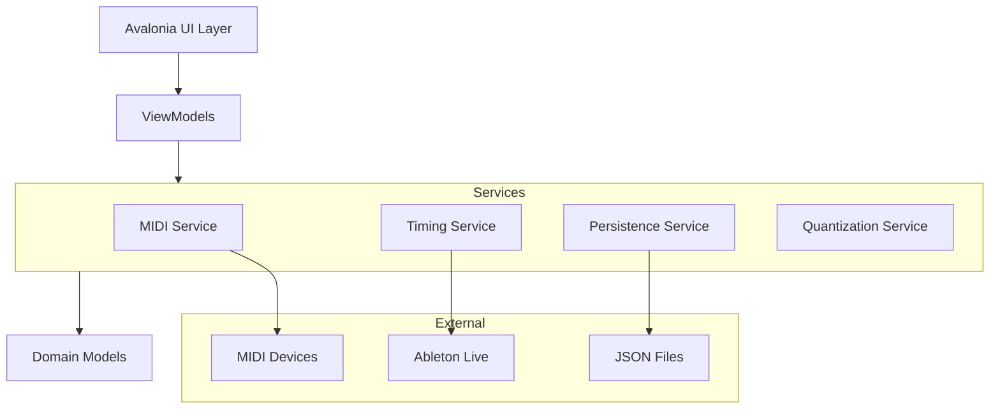

# Design Document

## Overview

The Circular MIDI Generator is architected as a real-time C# application using Avalonia UI for cross-platform compatibility and DryWetMIDI for professional MIDI output. The core design centers around a custom circular canvas control that renders a spinning disk interface where users can place and manipulate colored markers. The application uses a Model-View-ViewModel (MVVM) pattern with reactive programming principles to ensure smooth real-time performance and responsive UI updates.

The system is designed with modularity in mind, separating concerns between MIDI processing, timing/synchronization, marker management, lane control, and UI rendering. This allows for independent testing and future extensibility while maintaining high performance for real-time audio applications.

## Architecture

### High-Level Architecture



### Core Components

1. **CircularCanvas**: Custom Avalonia control for rendering the spinning disk interface
2. **MarkerManager**: Handles marker placement, movement, and lifecycle
3. **LaneController**: Manages multiple lanes and their independent settings
4. **TimingEngine**: Coordinates disk rotation, playhead position, and tempo sync
5. **MIDIProcessor**: Handles MIDI output and device communication
6. **QuantizationEngine**: Manages grid snapping and visual grid overlay

## Components and Interfaces

### 1. Domain Models

#### Marker Model
```csharp
public class Marker
{
    public Guid Id { get; set; }
    public double Angle { get; set; }           // Position on circle (0-360 degrees)
    public Color Color { get; set; }            // Determines MIDI pitch
    public int Velocity { get; set; }           // MIDI velocity (1-127)
    public int Lane { get; set; }               // Lane assignment
    public bool IsActive { get; set; }          // Currently being triggered
    public DateTime LastTriggered { get; set; } // Prevent double-triggering
}
```

#### Lane Model
```csharp
public class Lane
{
    public int Id { get; set; }
    public string Name { get; set; }
    public int MidiChannel { get; set; }
    public bool IsMuted { get; set; }
    public bool IsSoloed { get; set; }
    public QuantizationSettings Quantization { get; set; }
    public Color ThemeColor { get; set; }
    public ObservableCollection<Marker> Markers { get; set; }
}
```

#### Configuration Model
```csharp
public class ProjectConfiguration
{
    public double BPM { get; set; }
    public bool IsAbletionSyncEnabled { get; set; }
    public List<Lane> Lanes { get; set; }
    public QuantizationSettings GlobalQuantization { get; set; }
    public string Version { get; set; }
    public DateTime Created { get; set; }
}
```

### 2. Service Interfaces

#### MIDI Service Interface
```csharp
public interface IMidiService
{
    Task InitializeAsync();
    void SendNoteOn(int channel, int note, int velocity);
    void SendNoteOff(int channel, int note);
    Task<List<MidiDevice>> GetAvailableDevicesAsync();
    void SetOutputDevice(MidiDevice device);
    bool ConnectToAbleton();
    void Dispose();
}
```

#### Timing Service Interface
```csharp
public interface ITimingService
{
    event EventHandler<PlayheadEventArgs> PlayheadMoved;
    event EventHandler<MarkerTriggeredEventArgs> MarkerTriggered;
    
    void Start();
    void Stop();
    void SetBPM(double bpm);
    void EnableAbletionSync(bool enabled);
    double CurrentAngle { get; }
    bool IsPlaying { get; }
}
```

#### Quantization Service Interface
```csharp
public interface IQuantizationService
{
    double SnapToGrid(double angle, QuantizationSettings settings);
    List<double> GetGridLines(QuantizationSettings settings);
    bool IsQuantizationEnabled(int laneId);
    void SetQuantization(int laneId, QuantizationSettings settings);
}
```

### 3. Custom UI Controls

#### CircularCanvas Control
- Inherits from Avalonia's Canvas control
- Handles mouse/touch input for marker placement and manipulation
- Renders spinning disk background, markers, grid overlay, and playhead
- Supports multi-touch gestures for marker selection and dragging
- Implements smooth animations using Avalonia's animation system

#### MarkerControl
- Custom control representing individual markers on the disk
- Handles velocity adjustment through drag interactions
- Provides visual feedback for selection and triggering states
- Supports color-coding for pitch visualization

#### LanePanel Control
- UI component for lane management (mute/solo/settings)
- Displays lane-specific quantization controls
- Shows visual grouping and color coding for lane identification

## Data Models

### Color-to-Pitch Mapping
The application uses a chromatic color wheel mapping where:
- Red (0°) = C
- Orange (30°) = C#/Db
- Yellow (60°) = D
- And so on through the chromatic scale

This provides an intuitive visual representation where warmer colors represent lower pitches and cooler colors represent higher pitches.

### Quantization Grid System
Quantization divisions are calculated as:
- 1/4 note = 4 grid lines (90° intervals)
- 1/8 note = 8 grid lines (45° intervals)  
- 1/16 note = 16 grid lines (22.5° intervals)
- 1/32 note = 32 grid lines (11.25° intervals)

Grid lines rotate in sync with the playhead, maintaining visual consistency.

### Persistence Schema
JSON configuration files store:
```json
{
  "version": "1.0",
  "bpm": 120.0,
  "abletionSyncEnabled": false,
  "lanes": [
    {
      "id": 0,
      "name": "Drums",
      "midiChannel": 1,
      "isMuted": false,
      "isSoloed": false,
      "quantization": {
        "enabled": true,
        "division": "1/16"
      },
      "markers": [
        {
          "angle": 0.0,
          "color": "#FF0000",
          "velocity": 100,
          "lane": 0
        }
      ]
    }
  ]
}
```

## Error Handling

### MIDI Communication Errors
- Graceful fallback when MIDI devices are disconnected
- Automatic device reconnection attempts
- User notification for MIDI-related issues
- Logging of MIDI errors for debugging

### Timing Synchronization Errors
- Fallback to internal timing when Ableton sync fails
- Smooth tempo transitions to prevent audio glitches
- Recovery mechanisms for timing drift

### File I/O Errors
- Validation of JSON configuration files before loading
- Backup creation before saving configurations
- User-friendly error messages for corrupted files
- Default configuration restoration when needed

### UI Responsiveness
- Background threading for MIDI processing to prevent UI blocking
- Efficient rendering optimizations for smooth animations
- Memory management for marker collections
- Performance monitoring and optimization

## Testing Strategy

### Unit Testing
- **Domain Models**: Test marker calculations, color-to-pitch mapping, quantization logic
- **Services**: Mock external dependencies (MIDI devices, file system) for isolated testing
- **Quantization Engine**: Verify grid snapping accuracy across different divisions
- **Timing Calculations**: Test BPM conversions and angle calculations

### Integration Testing
- **MIDI Output**: Test with virtual MIDI devices to verify note timing and accuracy
- **File Persistence**: Test save/load cycles with various configuration scenarios
- **UI Interactions**: Test marker placement, dragging, and removal workflows
- **Multi-lane Coordination**: Verify independent lane settings and mute/solo behavior

### Performance Testing
- **Real-time Performance**: Measure timing accuracy under various system loads
- **Memory Usage**: Monitor marker collection performance with large numbers of markers
- **UI Responsiveness**: Test smooth animation performance during intensive operations
- **MIDI Latency**: Measure and optimize MIDI output timing precision

### User Acceptance Testing
- **Workflow Testing**: Complete pattern creation and playback scenarios
- **Ableton Integration**: Test tempo sync and MIDI routing with actual DAW
- **Multi-touch Interaction**: Verify gesture support on touch-enabled devices
- **Visual Design**: Validate playful aesthetic and color scheme effectiveness

### Automated Testing Framework
- Use xUnit for unit and integration tests
- Implement custom test helpers for Avalonia UI testing
- Create mock MIDI devices for consistent testing
- Set up continuous integration for automated test execution

The testing strategy emphasizes real-time performance validation since timing accuracy is critical for musical applications. Special attention is given to testing the interaction between multiple concurrent systems (UI, MIDI, timing) to ensure smooth operation under various conditions.